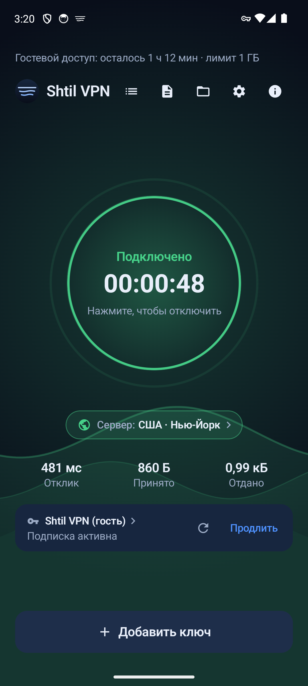
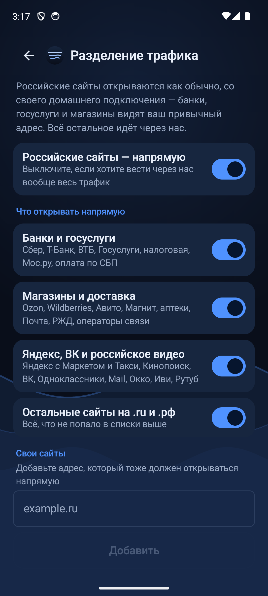
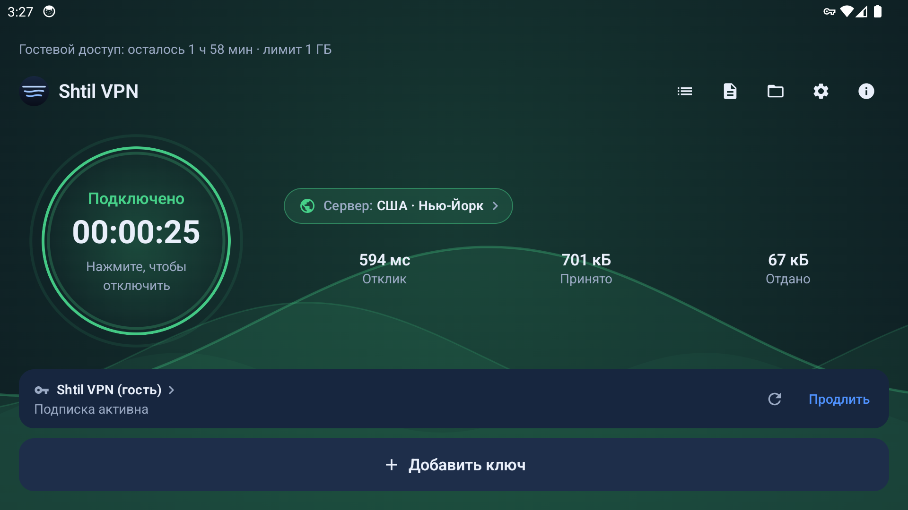
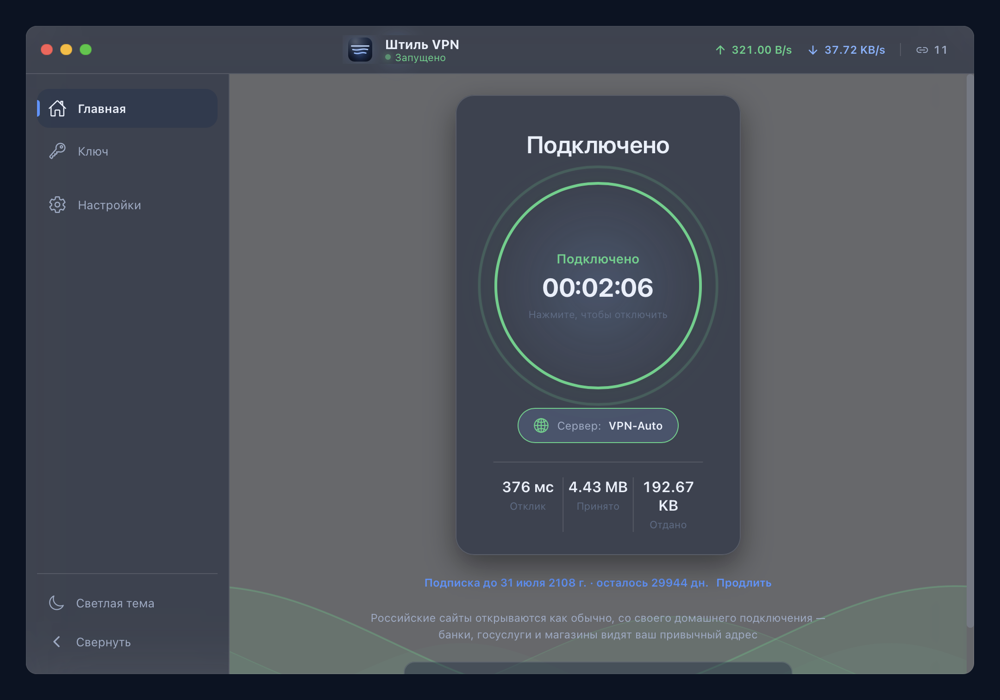

# Штиль VPN · Shtil VPN

**Русский** · [English](README.en.md) · [Deutsch](README.de.md) · [Español](README.es.md) · [فارسی](README.fa.md)

**VPN-приложения на ядре [sing-box](https://github.com/SagerNet/sing-box) (VLESS + Reality)
для телефона, телевизора Android, Windows и macOS.**

Российские сайты — банки, госуслуги, маркетплейсы — при включённом VPN
продолжают открываться напрямую, мимо туннеля.

---

## Коротко

| Вопрос | Ответ |
|---|---|
| Что это | Клиент VPN: телефон и телевизор Android, Windows, macOS |
| Ядро и протокол | sing-box, VLESS + Reality поверх TCP |
| Российские сайты | идут напрямую, списки маршрутов лежат внутри приложения |
| Ключ | ссылка-подписка из Telegram-бота, подойдёт и от другого поставщика в формате VLESS |
| Магазины приложений | не нужны: файл раздаём сами, обновление приходит по воздуху |
| Языки интерфейса | русский, английский, немецкий, испанский, персидский |
| Условия подписки | их называет сам бот — здесь мы их не публикуем |
| Учётные записи внутри приложения | нет. Ни рекламы, ни встроенных покупок |

---

## Что скачать

| Устройство | Файл | Как поставить |
|---|---|---|
| **Телефон и планшет Android** | [sub.ndvsdom54.ru/get](https://sub.ndvsdom54.ru/get) — страница сама подберёт файл | Открыть адрес в браузере телефона, нажать «Скачать» |
| **Телевизор Android TV** | [sub.ndvsdom54.ru/tv.apk](https://sub.ndvsdom54.ru/tv.apk) — файл едет сразу | Набрать адрес в качалке (например Downloader) пультом |
| **Компьютер Windows** | [ShtilVPN-windows.exe](https://github.com/narvinIR/shtil-vpn/releases/download/apps/ShtilVPN-windows.exe) | Скачать и запустить |
| **Mac с процессором Apple** | [ShtilVPN-mac-apple.dmg](https://github.com/narvinIR/shtil-vpn/releases/download/apps/ShtilVPN-mac-apple.dmg) | Перетащить в «Программы» |
| **Mac на Intel** (2020 и старше) | [ShtilVPN-mac-intel.dmg](https://github.com/narvinIR/shtil-vpn/releases/download/apps/ShtilVPN-mac-intel.dmg) | Перетащить в «Программы» |

Не уверены, какой файл для Android нужен — берите
[universal](https://github.com/narvinIR/shtil-vpn/releases/download/apps/ShtilVPN-android-universal.apk):
он самый тяжёлый (около 76 МБ), но встаёт на любое устройство.

Все файлы одним списком — в [разделе «Штиль — файлы для
установки»](https://github.com/narvinIR/shtil-vpn/releases/tag/apps). Адреса
там постоянные: обновляется файл, а ссылка остаётся прежней.

Приложение — это вход в туннель, сервер в него не входит: нужна ссылка-подписка.
Свою выдаёт бот [@RealityVPNBot_bot](https://t.me/RealityVPNBot_bot), он же
называет условия; подойдёт и ссылка другого поставщика в формате VLESS.

---

## Три шага до подключения

1. Скачать файл для своего устройства из таблицы выше и поставить.
2. Нажать «Попробовать сейчас» (2 часа без Telegram) **или** получить ссылку-подписку
   в боте и добавить её в приложении — вручную, из буфера обмена либо кодом с QR.
3. Нажать «Подключить». Российские сайты продолжат открываться напрямую — так и задумано.

Телевизор ключ не набирает: код показывается на экране QR-кодом, телефон его
сканирует, и подписка приезжает на телевизор сама.

---

## Как выглядит

| Телефон: подключено | Телефон: разделение трафика | Телевизор | Компьютер |
|---|---|---|---|
|  |  |  |  |

---

## Что умеет каждое приложение

| Возможность | Телефон | Телевизор | Windows | macOS |
|---|:---:|:---:|:---:|:---:|
| VLESS + Reality на ядре sing-box | да | да | да | да |
| Российские сайты напрямую (списки внутри приложения) | да | да | да | да |
| Ссылка-подписка вместо длинного ключа | да | да | да | да |
| Привязка коротким кодом из бота | да | да | да | да |
| Код приезжает QR-кодом с телефона | да | да | — | — |
| Пробный доступ без Telegram, 2 часа | да | да | да | да |
| Обновление по воздуху, мимо магазинов | да | да | да | да |
| Выбор приложений в туннель | да | да | — | — |
| Раскладка под пульт | — | да | — | — |
| Журнал и список соединений | в работе | в работе | да | да |
| Пять языков интерфейса | да | да | да | да |

---

## Что внутри

- **Ядро** — [sing-box](https://github.com/SagerNet/sing-box), протокол VLESS + Reality
  поверх TCP.
- **Разделение трафика.** Списки российских доменов и адресов лежат внутри приложения
  и никуда не ходят: сервер со списками может быть недоступен из России, и тогда VPN
  просто не включился бы. По доменам, идущим напрямую, отдаётся только адрес IPv4 —
  иначе устройство ушло бы мимо маршрута.
- **Один ключ на все устройства.** Ссылка-подписка работает и на телефоне, и на
  телевизоре, и на компьютере; ключ на сервере меняется — все устройства
  подхватывают новый сами.
- **Обновления по воздуху.** Приложение проверяет новую версию само и предлагает
  поставить; на компьютере обновление ставится только с нашей подписью.
- **Ничего лишнего.** Учётных записей внутри приложения нет, рекламы нет,
  встроенных покупок нет.

---

## Что система скажет при установке

Приложения раздаются мимо магазинов Google и Apple, поэтому каждая система
один раз переспросит. Это происходит с любым приложением вне магазина.

**Android (телефон).** «Установка из этого источника запрещена» → разрешить
браузеру ставить приложения. Затем Google может показать красный экран
«Приложение может быть опасным» → «Всё равно установить».

**Android TV (телевизор).** Тот же красный экран Google, кнопка подтверждения
внизу — доводить пультом.

**Windows.** Синее окно «Windows защитила ваш компьютер» → **«Подробнее» →
«Выполнить в любом случае»**. Сертификат издателя у нас не куплен: Microsoft с
2024 года не продаёт мгновенное доверие даже за деньги — репутация набирается
числом установок.

**macOS.** Первый запуск система не разрешит → **Системные настройки →
Конфиденциальность и безопасность → «Открыть всё равно»** → пароль
администратора. Дальше приложение открывается обычным двойным щелчком.

---

## Частые вопросы

**Нужен ли Google Play или App Store?**
Нет. Файл скачивается по ссылке отсюда или с [страницы установки](https://sub.ndvsdom54.ru/get),
новые версии приложение находит само.

**Как поставить на телевизор, если браузера там нет?**
Через качалку вроде Downloader: набрать пультом `sub.ndvsdom54.ru/tv.apk`, файл
приедет сразу. Адрес специально короткий и без «https://».

**Почему банк или госуслуги не хотят работать через VPN?**
У нас не хотеть нечему: российские сайты идут напрямую, мимо туннеля. Список
едет внутри приложения и работает даже там, где серверы со списками недоступны.

**Подойдёт ли ключ другого поставщика?**
Да, если это ссылка-подписка или ключ в формате VLESS. Приложение — вход в
туннель, сервер в него не входит.

**Сколько устройств на один ключ?**
Два одновременно. Ссылка-подписка одна на все — телефон, телевизор, компьютер.

**Есть ли версия для iPhone или Linux?**
Своего приложения нет. Ссылка-подписка работает в сторонних клиентах — например
в v2RayTun на iOS или в любом клиенте sing-box.

**Что с журналами и учётными записями?**
Внутри приложения нет ни учётных записей, ни рекламы, ни встроенных покупок.
Подписку и оплату ведёт Telegram-бот.

---

## Приложения и исходники

| Приложение | Система | Исходники | Лицензия |
|---|---|---|---|
| Штиль (Android) | Android 6.0 и новее, телефоны и телевизоры | форк [vpn4tv-native](https://github.com/VPN4TV/vpn4tv-native) | GPL-3.0 |
| Штиль для компьютера | Windows 10/11, macOS 12 и новее | [shtil-vpn-desktop](https://github.com/narvinIR/shtil-vpn-desktop) | MIT |
| Ядро | внутри обоих приложений | [sing-box](https://github.com/SagerNet/sing-box) | GPL-3.0 |

Этот репозиторий — витрина: описания и постоянные ссылки на файлы. Каждый файл
распространяется по лицензии своего приложения из таблицы выше.

Вопрос, отчёт об ошибке или предложение — [issues](https://github.com/narvinIR/shtil-vpn/issues)
или бот [@RealityVPNBot_bot](https://t.me/RealityVPNBot_bot).
